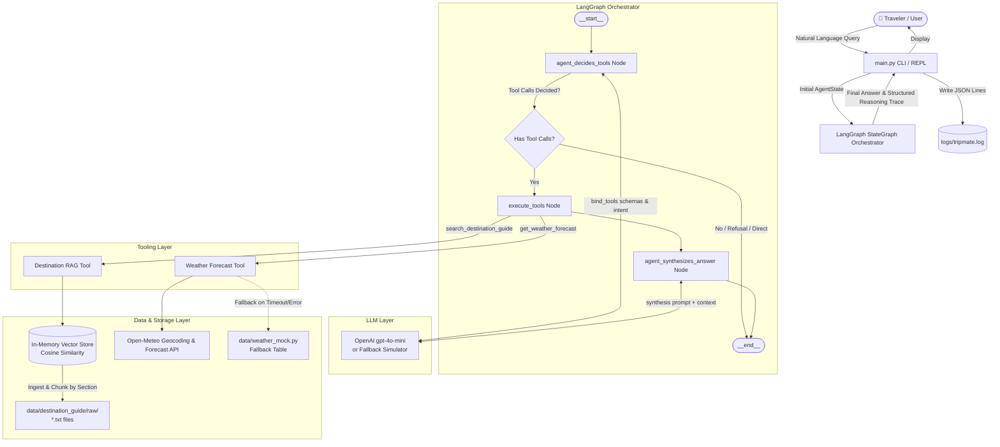

# TripMate System Architecture

This document provides a comprehensive structural and behavioral overview of the **TripMate** agentic travel assistant core.

---

## High-Level Architecture Diagram

---

## Component Deep Dive

### 1. LangGraph StateGraph & Execution Flow

TripMate uses an explicit, inspectable state machine implemented with LangGraph:

- **State Representation (`AgentState`)**:
  - `query` (`str`): The raw incoming user question.
  - `messages` (`Sequence[BaseMessage]`): Conversation history containing `HumanMessage`, `AIMessage` (with `tool_calls`), and `ToolMessage` payloads.
  - `reasoning_trace` (`list[ReasoningStep]`): Structured record documenting each step index, tool invoked, input arguments, dynamic rationale, and tool execution outputs.
  - `final_answer` (`str`): Synthesized traveler-facing recommendation.
  - `is_out_of_scope` (`bool`): Flag denoting non-informational queries refused at the boundary.

- **State Transitions**:
  1. `START` -> `agent_decides_tools`: The LLM inspects the prompt, tool definitions, and user question. If tool calls are generated, reasoning steps are recorded.
  2. `route_after_agent`: If tool calls were requested, routes to `execute_tools`. If no tools were called (e.g. out-of-scope refusal or clarifying question), execution finishes directly.
  3. `execute_tools`: Tools are executed inside try/except blocks. Tool outputs are appended as `ToolMessage` and populated into the `reasoning_trace`.
  4. `agent_synthesizes_answer`: The LLM fuses the original question, destination cultural guidelines, and seasonal weather metrics into a unified answer.
  5. `END`: The final state is returned to the CLI or caller.

---

## Tooling & Storage Subsystems

### 2. Destination Knowledge Tool (RAG)
- **Automatic Ingestion**: Scans `data/destination_guide/raw/*.txt` without hardcoded filenames.
- **Section Chunking**: Chunks by semantic sections (`VISA & ENTRY`, `BEST TIME TO VISIT`, `LOCAL CUSTOMS`, `PACKING TIPS`, `SAFETY & HEALTH`) with `{city, section, country}` metadata tags.
- **In-Memory Store**: Swappable `BaseVectorStore` interface using OpenAI `text-embedding-3-small` (or deterministic lexical vectors in offline mode) with cosine similarity and domain-specific section boosting (e.g., boosting `PACKING TIPS` for clothing questions).

### 3. Weather Forecast Tool
- **Primary Source**: Open-Meteo live API. Geocodes the destination city, queries temperature ranges and WMO weather codes, and parses the forecast.
- **Resilient Fallback**: If an Open-Meteo call encounters network latency, timeouts (>5s), or HTTP errors, it triggers a seamless fallback to `data/weather_mock.py` and tags `source: "mock"`.

---

## Observability & Structured Logging

All executions output to two channels:
1. **Console**: Displays the user-friendly final answer accompanied by an elegant ASCII box detailing the agent's step-by-step reasoning trace in verbose mode.
2. **File (`logs/tripmate.log`)**: Emits structured JSON Lines records capturing timestamps, log levels, component names, tool arguments, and graph decision events.
